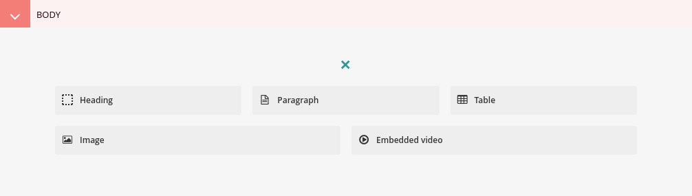
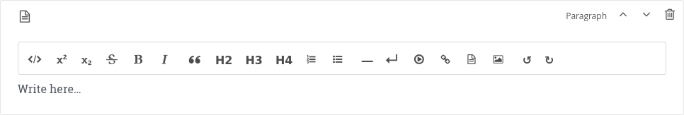
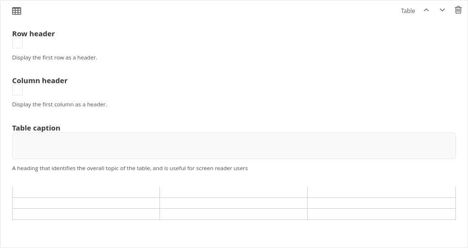
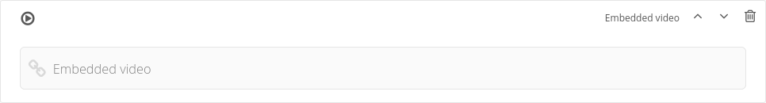
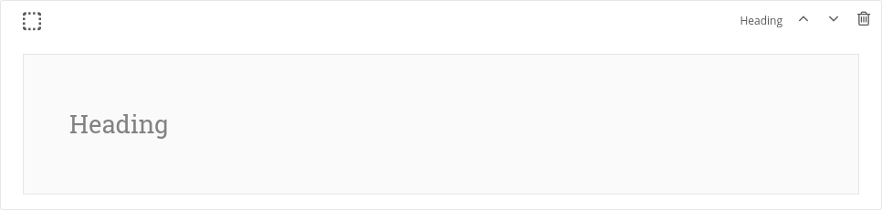
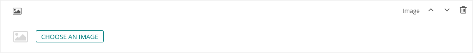

Editing Content
===============

Some sections of web pages are open-ended in terms of the content they can hold. Here are some basic tips when editing
these areas.

Paragraph
---------
Provide rich text, add images, links, lists, block quotes, code, headings, etc.

Tables
------
When editing pages with tables, on some browsers, the content of the tables does not appear when you initially open the editing interface. Try adjusting the width of your browser slightly and the content should show up.

To create a new line within a table cell, type Alt+Enter.

Embedded Video
--------------
Include embedded videos from external sites like YouTube.

Heading
-------

Image
-----
Choose from images that are already uploaded to the site, or upload a new image.

