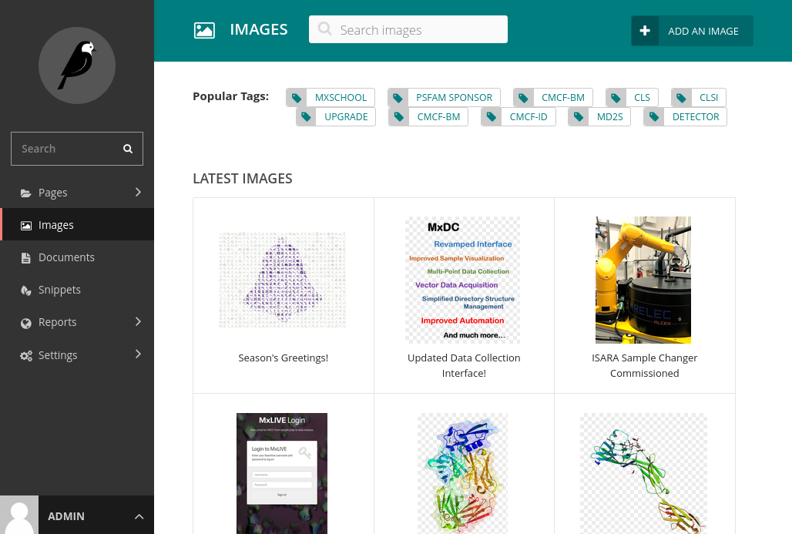
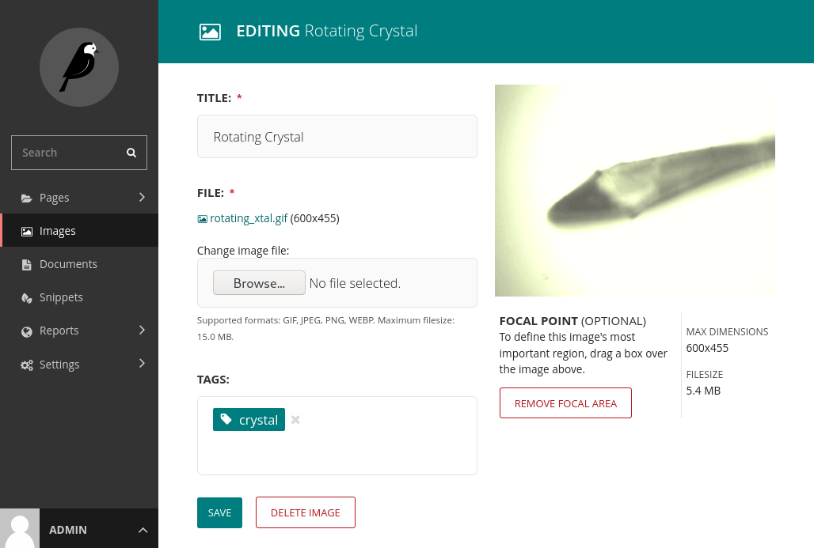

Images
======

When adding an image:

- try to use an appropriate resolution - more than 800px wide is likely unnecessary,
- give a readable and accurate title to the image - this may be displayed when the user hovers over the image.

